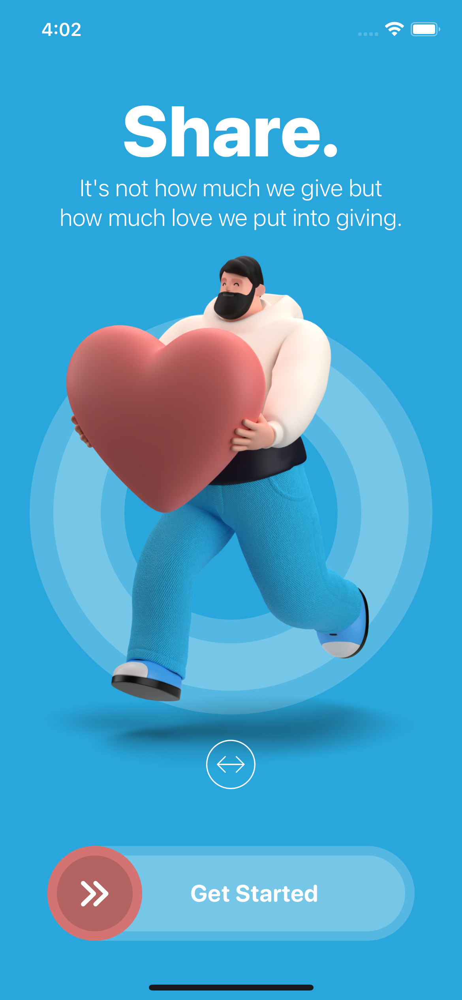
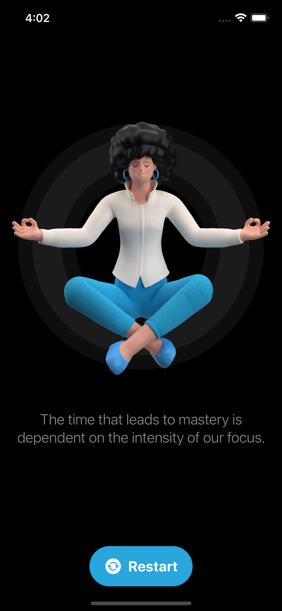

# Restart_SwiftUI

---

<h2> 
  Full featured SwiftUI Application With Custom Animation and Custom Buttons.
</h2>

  
  

---

<h2>
  Features
</h2>

- Drag on the Home screen to see the animation.
- Swipe the button to right and the animation begins.
- Detail page with SwiftUI elements.
- Button to come back to the home screen

---

<h2>
  Notes
</h2>

 SwiftUI Complex features beimh used to animate and create custom buttons.

---

<h2>
  Watch Full Video
</h2>

<a href="https://drive.google.com/file/d/1qErDON1VWAznd_m0HztdiSTUQmh4U9fc/view?usp=drivesdk"> Click here to Watch the full Functionality. </a>

---
